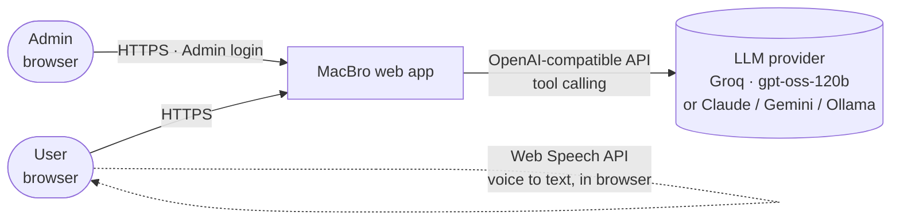
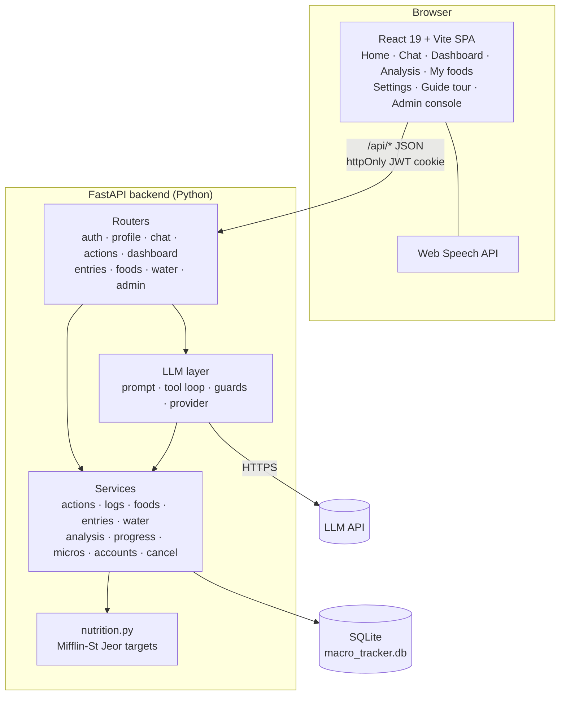
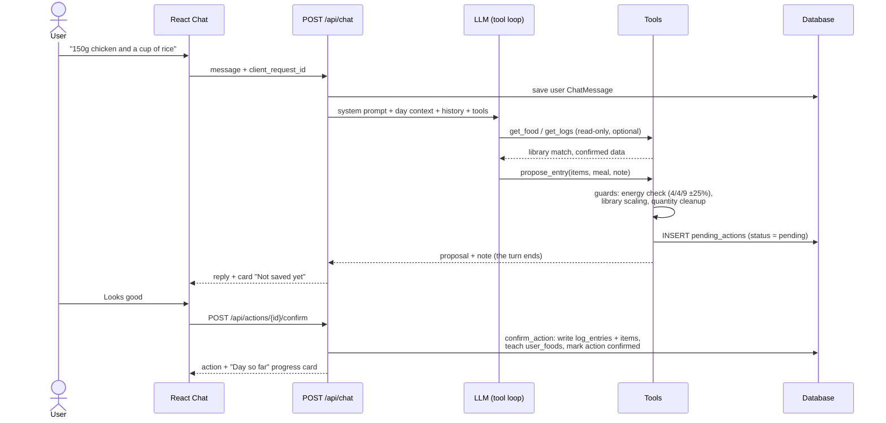
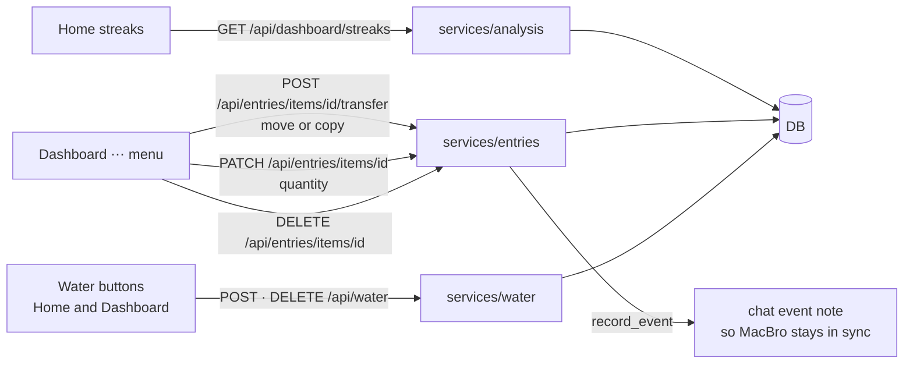
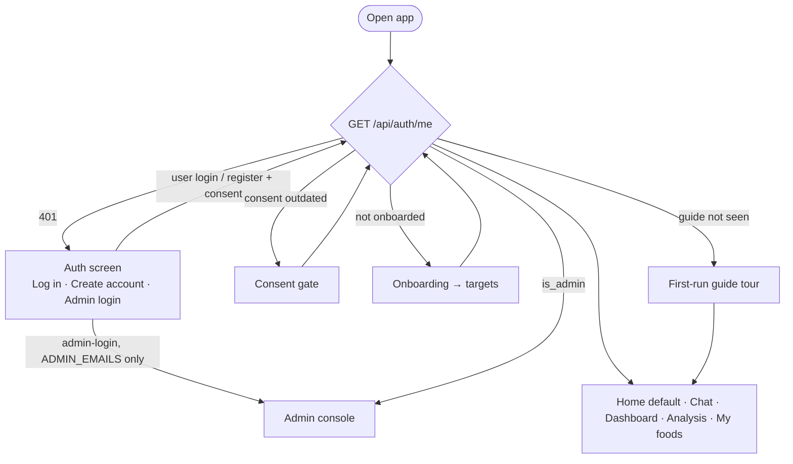
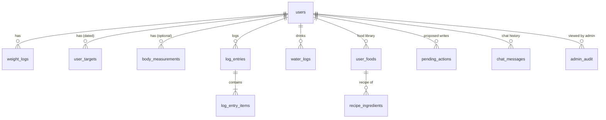

# MacBro high-level design (HLD)

> Last updated: 2026-09-28 (Home tab and streaks). Update the diagrams whenever a component, data flow, table or external service changes (see [docs/README.md](README.md)).
> Diagrams are Mermaid. They render on GitHub and in VS Code with a Mermaid preview extension.

## 1. Purpose and principles

MacBro is a chat-first calorie and macro tracker. Users describe food in natural language, an LLM estimates nutrition, and the user confirms before anything is stored.

**Design principles**

1. **The LLM proposes, the user disposes.** The model can only create *pending actions*. Every food, water or recipe write that comes from the chat goes through `confirm_action`, which only a user's button press can trigger.
2. **Deterministic numbers where possible.** Foods the user has already confirmed are stored in a personal library, and quantities are scaled in code, not by the model.
3. **Direct manipulation doesn't need the LLM.** Dashboard actions (move, copy, change quantity, delete, water buttons) write straight to the database, and the dashboard reads straight from it.
4. **Open-source, no paid credits at this stage.** The default model is open-weight (`gpt-oss-120b` on Groq's free tier). Claude is an optional provider behind the same interface. See [llm-routing-strategy.md](llm-routing-strategy.md).
5. **Degrade gracefully.** If the LLM is unavailable, users get a friendly "servers are temporarily down" message, and every non-chat feature keeps working.

## 2. System context

| Actor | Uses |
|---|---|
| **User** | Home (summary and streaks), Chat logging, Dashboard, Analysis, My foods, Settings |
| **Admin** (emails in `ADMIN_EMAILS`) | Admin console only: user list, per-user read-only data, audit log |
| **LLM provider** | Nutrition estimation, clarifying questions, choosing tools. It never writes data. |

## 3. Container view

In development, Vite serves the SPA on `:5173` and proxies `/api` to Uvicorn on `:8000`.

## 4. Key flows

### 4.1 Logging food through chat (the confirm loop)

- **Needs changes:** the user's correction is sent with `feedback_on_action_id`. The model proposes again, and the old card becomes *superseded*.
- **Cancel:** `POST /api/actions/{id}/reject`. Nothing is written except an event note that gives the model context.
- **Stop:** `POST /api/chat/cancel` marks the request cancelled. The backend checks it atomically before committing the reply (`finish_or_cancelled`). If it's too late, the UI keeps the reply.
- **Pending actions expire** after 24 hours, lazily on the next request.

### 4.2 Direct dashboard actions (no LLM)

### 4.3 Authentication and roles

Admin emails can't register or use the normal login. Admin accounts are hidden from the admin user list, and every admin view of a user's data is written to `admin_audit`.

## 5. Data model (overview)

Column-level detail is in [technical-overview.md](technical-overview.md#5-data-model).

## 6. LLM layer at a glance

| Aspect | Design |
|---|---|
| Provider | `LLM_PROVIDER=openai_compatible` (Groq by default) or `anthropic`, behind one `Provider` interface |
| Tools | Read: `get_food`, `get_logs`, `get_daily_summary`. Propose: `propose_entry`, `propose_edit`, `propose_delete`, `propose_move`, `propose_recipe`, `propose_water` |
| Prompt | Stable system prompt (MacBro persona and rules, cacheable) plus per-turn dynamic context (date, time, targets, today's totals, my foods, item ids) |
| History | Last `CHAT_HISTORY_MESSAGES` messages (12 on the free tier) |
| Guards | Energy balance, quantity cleanup, false "Logged" claim nudge, missed-water nudge, move-vs-delete guard |
| Failure | Any provider error → HTTP 503 with a friendly message (`SHOW_LLM_ERRORS=true` shows details in dev) |

## 7. Non-functional notes

| Area | Current state | Planned |
|---|---|---|
| **Security** | scrypt password hashes, JWT in an httpOnly SameSite cookie, per-user scoping on every query, admin audit | HTTPS + `COOKIE_SECURE`, rate limiting, OTP email verification |
| **Privacy** | Consent at sign-up (versioned), full account deletion | Data export |
| **Scale** | Single process, SQLite | Postgres (e.g. Neon), stateless app instances |
| **LLM capacity** | Groq free tier: about 200K tokens/day, 8K tokens/min | Multi-model routing across free providers, see [llm-routing-strategy.md](llm-routing-strategy.md) |
| **Accessibility** | WCAG AA contrast in light and dark, keyboard tooltips, ARIA tabs and dialogs | – |
| **Deployment** | Local only | Hosted frontend and backend (e.g. Render) with managed Postgres |
