# Tandurust high-level design (HLD)

> Last updated: 2026-10-01 (welcome page as the start for signed-out visitors, on the static site and at /welcome; new logo and theme, display only; 2026-09-30: tab order Home, Meals, My Foods, Body Stats, Explore; tabs renamed: Saved Food → **My Foods**, Body Profile → **Body Stats**; app renamed Tandurust, display only; Dashboard tab renamed Meals, Analysis moved into it; Chat moved from a tab to a floating chat window opened from Home; Saved Food tabs: Generic / Branded / My Recipes; Saved Food + Add: §4.6; branded foods: Open Food Facts label check, §2, §3, §4.5, §5; optional "About you" answers: targets, meal times, MacBro context; country/region step in the sign-in flow; database hardening phase 1: public user UUIDs, items linked to foods, ON DELETE rules, timestamptz, composite indexes; built-in general food list (USDA) between Saved Food and the AI; raw/cooked asked, never assumed; typo-tolerant saved-food and meal-word matching, Dashboard "Did you mean …?"; earlier: tabs: Saved Food, Explore, Body Profile; admin two-step sign-in; tool allow-list; terms page; earlier: health notes, Alembic, forgot password…).Update the diagrams whenever a component, data flow, table or external service changes (see [docs/README.md](README.md)).
> Diagrams are Mermaid. They render on GitHub and in VS Code with a Mermaid preview extension.

## 1. Purpose and principles

Tandurust is a chat-first calorie and macro tracker; its chat assistant is called MacBro. Users describe food in natural language, an LLM estimates nutrition, and the user confirms before anything is stored.

**Design principles**

1. **The LLM proposes, the user disposes.** The model can only create *pending actions*. Every food, water or recipe write that comes from the chat goes through `confirm_action`, which only a user's button press can trigger.
2. **Deterministic numbers where possible.** Foods the user has already confirmed are stored in a personal library, and quantities are scaled in code, not by the model.
3. **Direct manipulation doesn't need the LLM.** Dashboard actions (move, copy, change quantity, delete, water buttons) write straight to the database, and the dashboard reads straight from it.
4. **Open-source, no paid credits at this stage.** The default model is open-weight (`gpt-oss-120b` on Groq's free tier). Claude is an optional provider behind the same interface. See [llm-routing-strategy.md](llm-routing-strategy.md).
5. **Degrade gracefully.** If the LLM is unavailable, users get a friendly "servers are temporarily down" message, and every non-chat feature keeps working.

## 2. System context

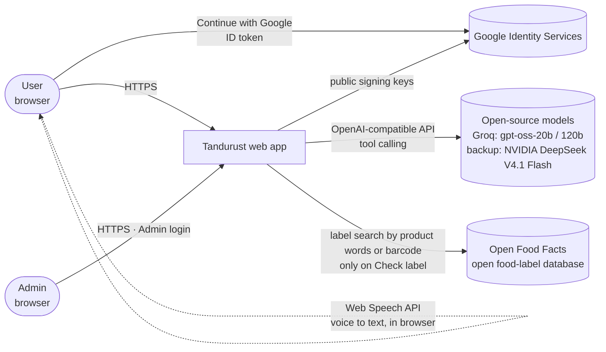

| Actor | Uses |
|---|---|
| **User** | Home (summary, meal-logging and protein streaks), Chat logging, Meals (day summary, meal cards, Check your progress), My Foods, Settings |
| **Admin** (emails in `ADMIN_EMAILS`) | Admin console only: user list, per-user read-only data, audit log |
| **LLM provider** | Nutrition estimation, clarifying questions, choosing tools. It never writes data. |
| **Open Food Facts** | Pack-label values for branded foods, searched only when the user presses **Check label**. It receives the search words or barcode, nothing about the user. |

## 3. Container view

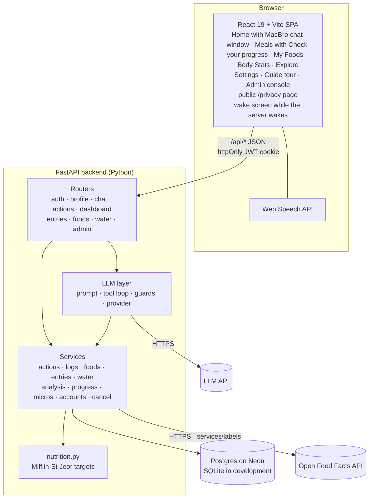

In development, Vite serves the SPA on `:5173` and proxies `/api` to Uvicorn on `:8000`, with SQLite as the database.

### 3.1 Production deployment

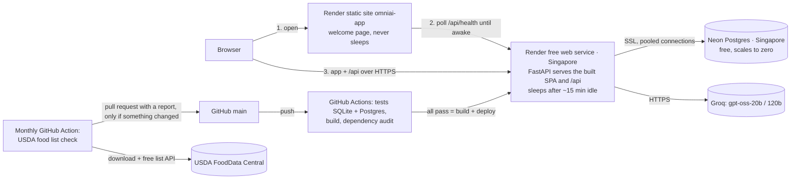

The free web service sleeps when idle, and Render shows its own page while it wakes. So people open the always-on static site, whose start page is the **welcome page** (since 2026-10-01; before, a "launcher" wake screen). It shows at once and wakes the app in the background; **Join** / **Log in** open the app's sign-up / login page as soon as it answers (a spinner until then). The app also serves the same page at `/welcome`, and sends every signed-out visitor there. Inside the app, a request that hits the sleeping server shows the same wake screen as an overlay and is retried once the server is back. The app itself stays one service, keeping the site and the API on one address (simple same-site cookie, one cold start). The server and the database share a region because one chat message makes many database round trips. Secrets are set in the Render dashboard. Step-by-step: [deployment.md](deployment.md).

## 4. Key flows

### 4.1 Logging food through chat (the confirm loop)

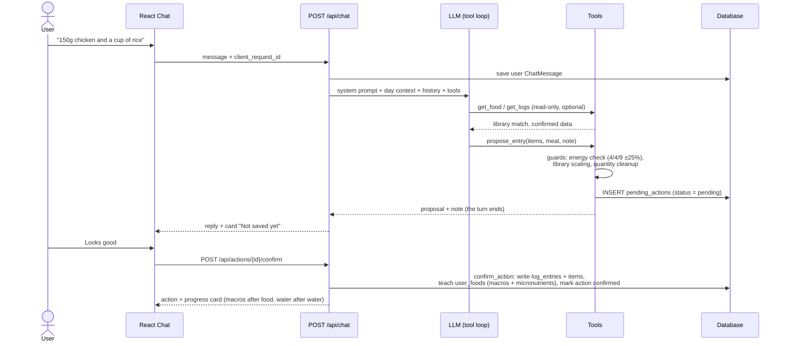

- **One chat per day:** the UI shows today's chat (older days load on request), and the model only sees today's messages plus a 3-hour grace window, which keeps prompts small.
- **Date picker:** a past day picked in the chat is sent as `log_date`. The model gets that day's entries and logs or edits there by default.
- **Needs changes:** the user's correction is sent with `feedback_on_action_id`. The model proposes again, and the old card becomes *superseded*.
- **Cancel:** `POST /api/actions/{id}/reject`. Nothing is written except an event note that gives the model context.
- **Stop:** `POST /api/chat/cancel` marks the request cancelled. The backend checks it atomically before committing the reply (`finish_or_cancelled`). If it's too late, the UI keeps the reply.
- **Pending actions expire** after 24 hours, lazily on the next request.

### 4.1b Which model answers a message

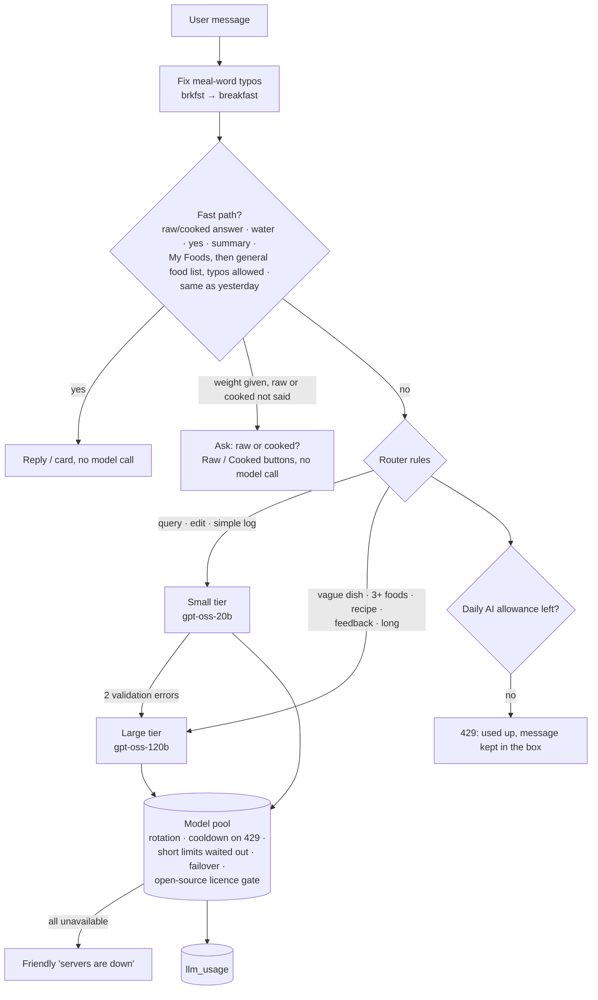

### 4.2 Direct dashboard actions (no LLM)

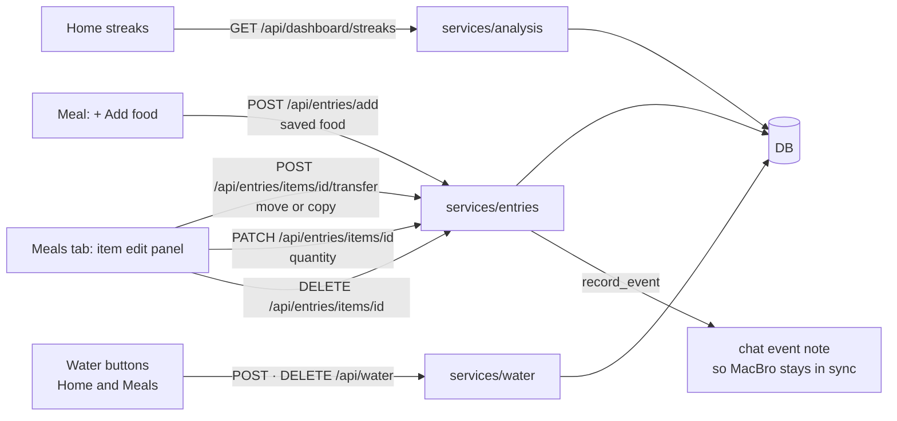

### 4.3 Authentication and roles

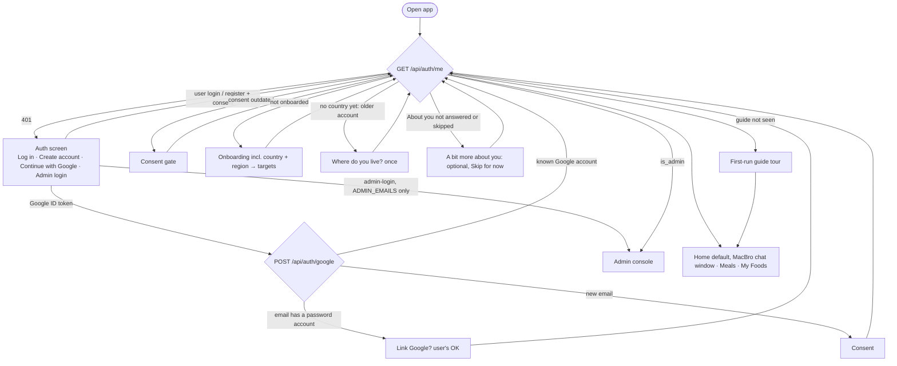

Admin emails can't register, use the normal login or Continue with Google.

**Google sign-in** uses Google Identity Services: the browser receives Google's signed ID token, and the backend checks the signature (Google's public keys), our client ID, the expiry and a verified email, then sets our own session cookie. There's no client secret, only the `openid email profile` scopes, and no Google review or billing. A Google sign-in is linked to an existing email + password account only after the user confirms, and a new account needs the data consent.

 Admin accounts are hidden from the admin user list, and every admin view of a user's data is written to `admin_audit`.

### 4.4 Adding food from the Meals tab

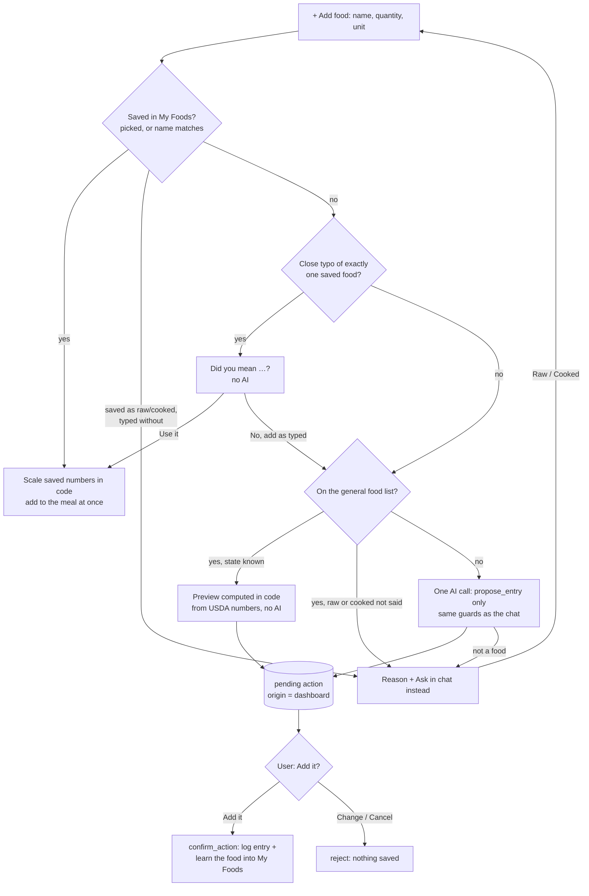

The AI estimate follows principle 1: it is a pending action, written only by `confirm_action` after **Add it**. It is kept apart from the chat: it isn't shown there or sent to the model as an open proposal, chat proposals don't replace it, and confirming it posts no progress card. Saved foods follow principle 3: the user's own click on their own numbers, applied directly.

### 4.5 Checking a branded food's label

A branded food first comes from the AI's memory of its label, so it is saved with `label_checked = false`. The user replaces that with the real pack label:

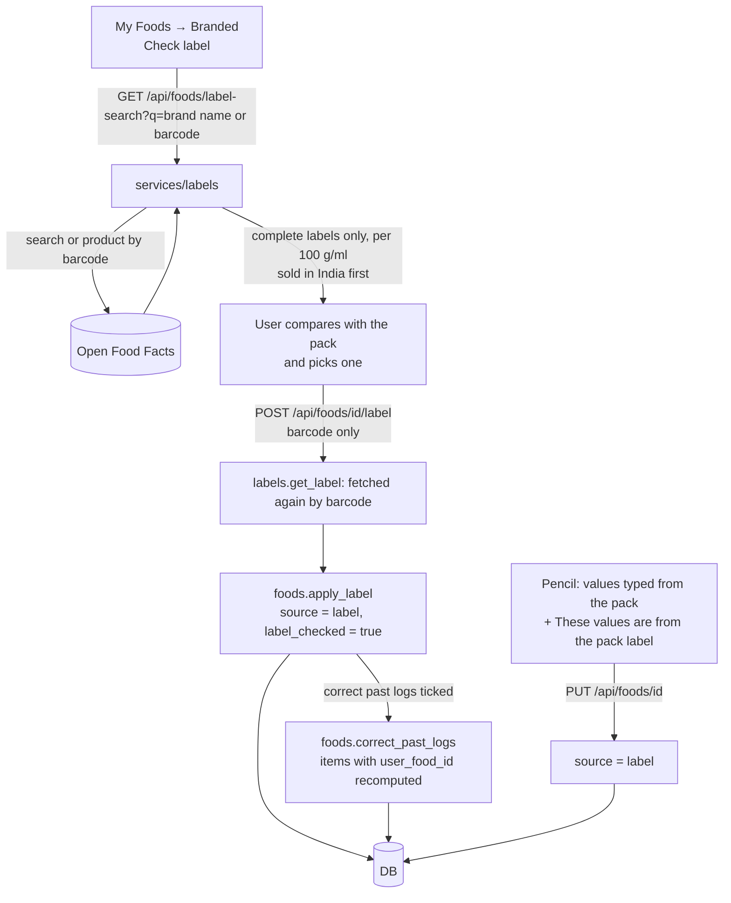

Principle 3 applies: the user's own click on a label they chose. The server never trusts label numbers sent by the browser; it re-fetches the product by barcode. A food marked `label` is never overwritten by a later AI estimate, and the model sees `| label |` on its line in "my foods", so it reuses the food's numbers.

### 4.6 Adding a food or recipe in My Foods (no LLM)

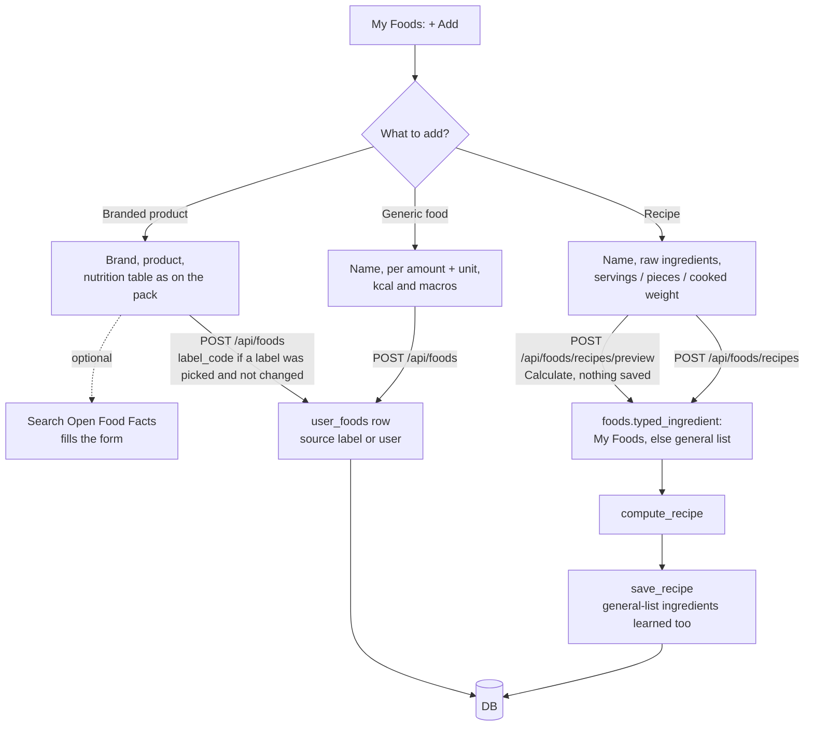

Principle 3 applies: the user's own typed numbers (or a label they picked, fetched again by barcode). The same name and brand can't be added twice (409); the model never reaches these routes.

## 5. Data model (overview)

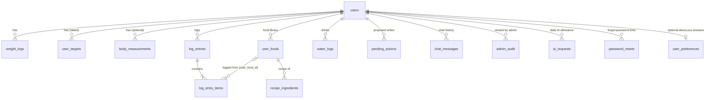

**Identity and integrity (migration 0003, 2026-09-30):** `users.id` is the internal key every table joins on; `users.public_id` (UUID v7) is what the API and admin screens show. Every foreign key has an ON DELETE rule, so deleting a user row removes everything they own in the database itself (model-usage and admin-audit rows are kept, unlinked). Logged items point at the saved food they came from, so "most eaten" is a count. Timestamps are `timestamptz` (UTC); per-user tables are indexed on (user_id, date) or (user_id, status).

**Branded foods (migration 0006, 2026-09-30):** `user_foods.label_checked` says whether a food's numbers come from its pack label, and `off_code` keeps the Open Food Facts barcode it was matched to (§4.5).

Column-level detail is in [technical-overview.md](technical-overview.md#5-data-model).

## 6. LLM layer at a glance

| Aspect | Design |
|---|---|
| Models | **Open-source only** (Apache 2.0 / MIT licences enforced in code). Two tiers on Groq's free tier: `gpt-oss-20b` (small) and `gpt-oss-120b` (large), in a quota-aware pool with cooldowns and failover; NVIDIA-hosted `deepseek-v4.1-flash` (MIT) as a slow backup used only when Groq is unavailable |
| Routing | L0 rule-based fast paths (no model) → rules pick intent + tier → small model, escalating to large on repeated validation errors. The Dashboard's Add food makes one `propose_entry`-only call for foods that aren't saved (`llm/estimate.py`). |
| Tools | Read: `get_food`, `get_logs`, `get_daily_summary`. Propose: `propose_entry`, `propose_edit`, `propose_delete`, `propose_move`, `propose_recipe`, `propose_water` |
| Prompt | Stable system prompt (MacBro persona and rules, cacheable) plus per-turn dynamic context (date, time, targets, today's totals, my foods, item ids) |
| History | Today's chat only (+3 h grace): last 6 messages on the small tier, 12 on the large |
| Per-call size | Only the tools and prompt sections the intent needs, and only saved foods and general-list foods named in the message, typos allowed (25–87% fewer instruction tokens per call) |
| General food list | ~300 common foods per 100 g from USDA FoodData Central (SR Legacy, public domain), a JSON file shipped with the backend (`app/data/general_foods.json`, built by `scripts/build_general_foods.py` from our curated `general_foods_spec.py`). Read-only, loaded once, no table. Order: My Foods → general list → AI. Raw/cooked pairs are asked, never assumed. Confirmed foods are copied into My Foods (`source = general`). A monthly GitHub Action rebuilds it from USDA and opens a pull request only when numbers change or USDA adds foods ([deployment.md](deployment.md)). |
| Observability | `llm_usage` table and the admin **AI usage** panel (calls, tokens, fast-path share, cooldowns) |
| Guards | Energy balance, quantity cleanup, false "Logged" claim nudge, missed-water nudge, move-vs-delete guard, tool allow-list per routed intent (other tool names are refused) |
| Failure | Any provider error → HTTP 503 with a friendly message (`SHOW_LLM_ERRORS=true` shows details in dev) |

## 7. Non-functional notes

| Area | Current state | Planned |
|---|---|---|
| **Security** | Argon2id password hashes (OWASP settings; old scrypt hashes upgraded at login; no timing hint for unknown emails), or Google sign-in (verified ID token, verified email); JWT in an httpOnly SameSite cookie (Secure over HTTPS in production) with a per-user session version, so a password change or Log out of all devices ends existing sessions, admin two-step sign-in (authenticator codes, encrypted secret, no replay) and 12-hour admin sessions, forgot password by one-time emailed link (Brevo; hashed token, 30 min, no account enumeration, links built from a fixed address), per-user scoping on every query, admin audit, sign-in attempt limits (per email and per address), browser security headers (CSP without inline scripts, no framing, HSTS over HTTPS), API docs off in production | OTP email verification |
| **Privacy** | Consent at sign-up (versioned); public plain-language notice at `/privacy`; **Download my data** (all rows, secrets excluded); full account deletion; adults only (18+ checked at onboarding) | Data retention periods and a scheduled purge; legal review before a public launch |
| **Scale** | Single process; Postgres on Neon (SQLite locally) | Stateless app instances (move in-memory state to the database or Redis) |
| **LLM capacity** | Groq free tier, per model (~200K tokens/day each for gpt-oss-20b and 120b); fast paths and slimmer calls stretch it; **daily AI allowance** per user (`AI_DAILY_MESSAGE_LIMIT`, 20, resets at local midnight; failed calls and instant replies don't count) | Second free provider for failover, see [llm-routing-strategy.md](llm-routing-strategy.md) |
| **Monitoring** | Request ids on every response and log line; unexpected errors return a reference the user can quote; optional Sentry error reports (nothing personal); `/api/health` for an uptime monitor | Create the Sentry and UptimeRobot accounts (deployment.md) |
| **Health safety** | Adults only; "estimates, not medical advice" at sign-in, on Home, Dashboard, Body and the privacy page; warning on calorie targets under 1,200 / 1,500 kcal; the model is told not to give medical advice | – |
| **Accessibility** | WCAG AA contrast in light and dark, keyboard tooltips, ARIA tabs and dialogs | – |
| **Responsive layout** | Phone/tablet: one column. Laptop (≥1024px): multi-column pages capped at 1200px, same top tabs. CSS only, no separate mobile app. | – |
| **Deployment** | Live at `omniai-hkv2.onrender.com`: Render free web service + Neon free Postgres, Singapore; the free service sleeps after ~15 min idle (30–60 s first load) | Uptime pinger, custom domain |
