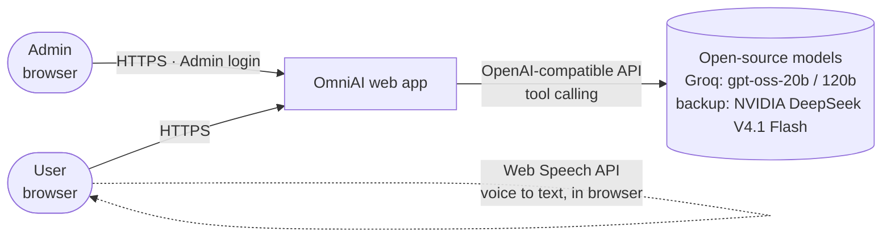
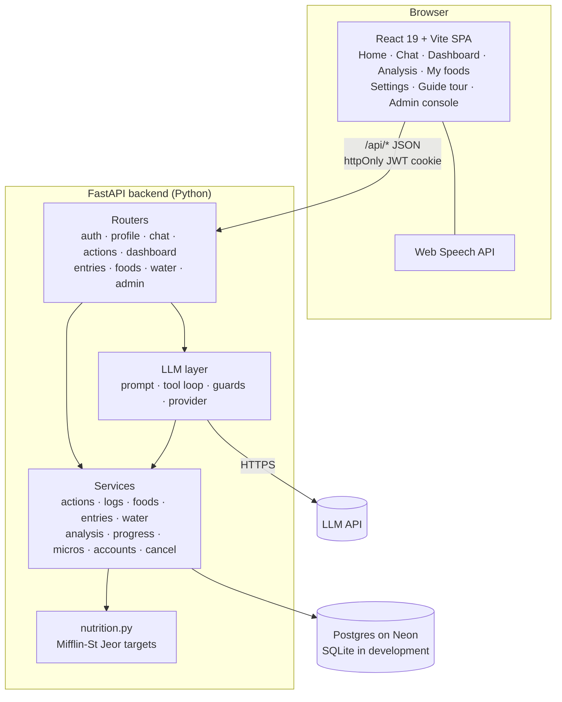
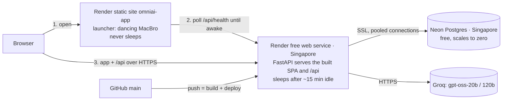
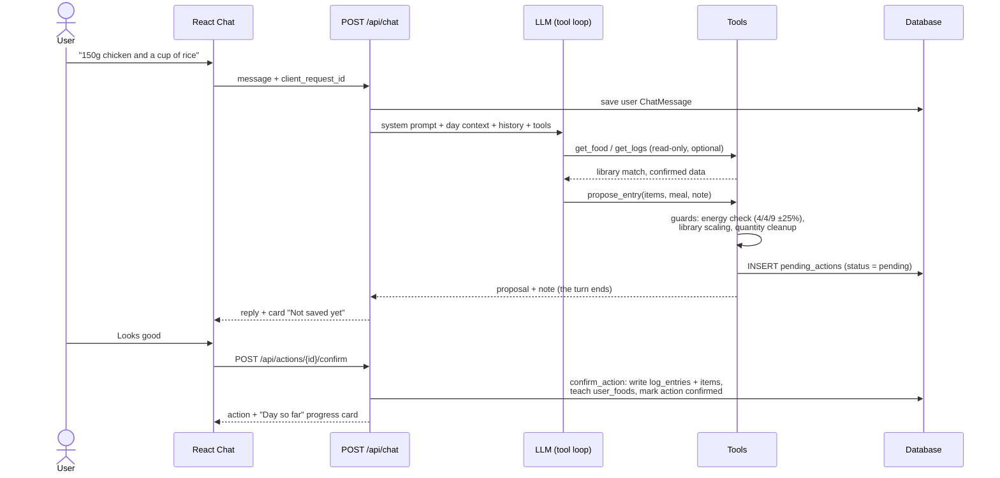
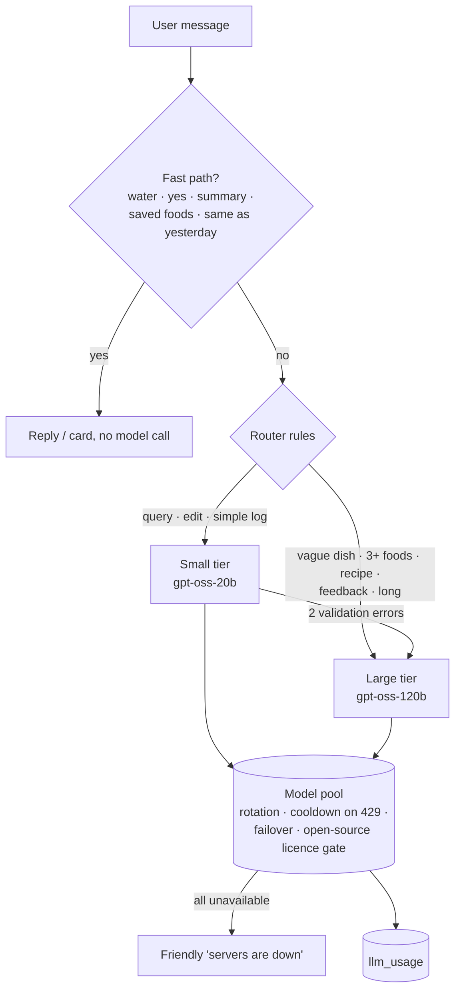
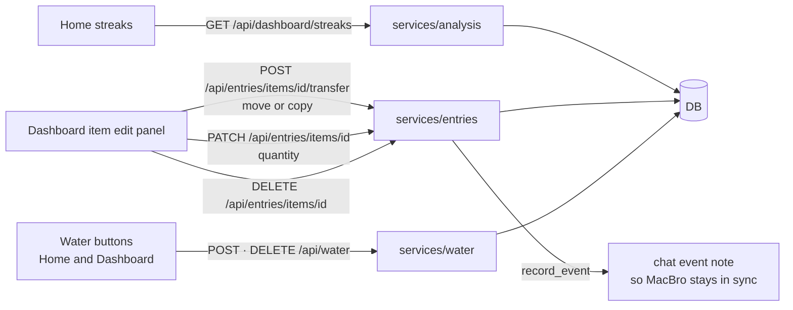
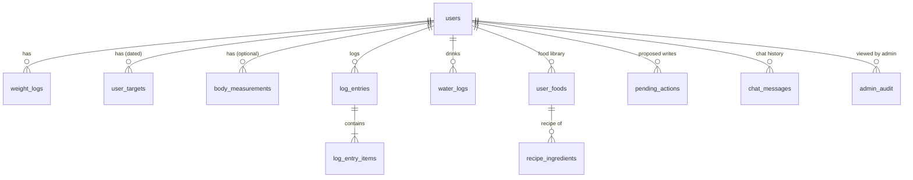

# OmniAI high-level design (HLD)

> Last updated: 2026-09-29 (always-on launcher with wake screen). Update the diagrams whenever a component, data flow, table or external service changes (see [docs/README.md](README.md)).
> Diagrams are Mermaid. They render on GitHub and in VS Code with a Mermaid preview extension.

## 1. Purpose and principles

OmniAI is a chat-first calorie and macro tracker; its chat assistant is called MacBro. Users describe food in natural language, an LLM estimates nutrition, and the user confirms before anything is stored.

**Design principles**

1. **The LLM proposes, the user disposes.** The model can only create *pending actions*. Every food, water or recipe write that comes from the chat goes through `confirm_action`, which only a user's button press can trigger.
2. **Deterministic numbers where possible.** Foods the user has already confirmed are stored in a personal library, and quantities are scaled in code, not by the model.
3. **Direct manipulation doesn't need the LLM.** Dashboard actions (move, copy, change quantity, delete, water buttons) write straight to the database, and the dashboard reads straight from it.
4. **Open-source, no paid credits at this stage.** The default model is open-weight (`gpt-oss-120b` on Groq's free tier). Claude is an optional provider behind the same interface. See [llm-routing-strategy.md](llm-routing-strategy.md).
5. **Degrade gracefully.** If the LLM is unavailable, users get a friendly "servers are temporarily down" message, and every non-chat feature keeps working.

## 2. System context

| Actor | Uses |
|---|---|
| **User** | Home (summary and streaks), Chat logging, Dashboard, Analysis, My foods, Settings |
| **Admin** (emails in `ADMIN_EMAILS`) | Admin console only: user list, per-user read-only data, audit log |
| **LLM provider** | Nutrition estimation, clarifying questions, choosing tools. It never writes data. |

## 3. Container view

In development, Vite serves the SPA on `:5173` and proxies `/api` to Uvicorn on `:8000`, with SQLite as the database.

### 3.1 Production deployment

The free web service sleeps when idle, and Render shows its own page while it wakes. So people open the always-on **launcher** (a free static site). It shows our wake screen until the app answers, then opens it. Inside the app, a request that hits the sleeping server shows the same wake screen as an overlay and is retried once the server is back. The app itself stays one service, keeping the site and the API on one address (simple same-site cookie, one cold start). The server and the database share a region because one chat message makes many database round trips. Secrets are set in the Render dashboard. Step-by-step: [deployment.md](deployment.md).

## 4. Key flows

### 4.1 Logging food through chat (the confirm loop)

- **One chat per day:** the UI shows today's chat (older days load on request), and the model only sees today's messages plus a 3-hour grace window, which keeps prompts small.
- **Date picker:** a past day picked in the chat is sent as `log_date`. The model gets that day's entries and logs or edits there by default.
- **Needs changes:** the user's correction is sent with `feedback_on_action_id`. The model proposes again, and the old card becomes *superseded*.
- **Cancel:** `POST /api/actions/{id}/reject`. Nothing is written except an event note that gives the model context.
- **Stop:** `POST /api/chat/cancel` marks the request cancelled. The backend checks it atomically before committing the reply (`finish_or_cancelled`). If it's too late, the UI keeps the reply.
- **Pending actions expire** after 24 hours, lazily on the next request.

### 4.1b Which model answers a message

### 4.2 Direct dashboard actions (no LLM)

### 4.3 Authentication and roles

Admin emails can't register or use the normal login. Admin accounts are hidden from the admin user list, and every admin view of a user's data is written to `admin_audit`.

## 5. Data model (overview)

Column-level detail is in [technical-overview.md](technical-overview.md#5-data-model).

## 6. LLM layer at a glance

| Aspect | Design |
|---|---|
| Models | **Open-source only** (Apache 2.0 / MIT licences enforced in code). Two tiers on Groq's free tier: `gpt-oss-20b` (small) and `gpt-oss-120b` (large), in a quota-aware pool with cooldowns and failover; NVIDIA-hosted `deepseek-v4.1-flash` (MIT) as a slow backup used only when Groq is unavailable |
| Routing | L0 rule-based fast paths (no model) → rules pick intent + tier → small model, escalating to large on repeated validation errors |
| Tools | Read: `get_food`, `get_logs`, `get_daily_summary`. Propose: `propose_entry`, `propose_edit`, `propose_delete`, `propose_move`, `propose_recipe`, `propose_water` |
| Prompt | Stable system prompt (MacBro persona and rules, cacheable) plus per-turn dynamic context (date, time, targets, today's totals, my foods, item ids) |
| History | Today's chat only (+3 h grace): last 6 messages on the small tier, 12 on the large |
| Per-call size | Only the tools and prompt sections the intent needs, and only saved foods named in the message (25–87% fewer instruction tokens per call) |
| Observability | `llm_usage` table and the admin **AI usage** panel (calls, tokens, fast-path share, cooldowns) |
| Guards | Energy balance, quantity cleanup, false "Logged" claim nudge, missed-water nudge, move-vs-delete guard |
| Failure | Any provider error → HTTP 503 with a friendly message (`SHOW_LLM_ERRORS=true` shows details in dev) |

## 7. Non-functional notes

| Area | Current state | Planned |
|---|---|---|
| **Security** | scrypt password hashes, JWT in an httpOnly SameSite cookie (Secure over HTTPS in production), per-user scoping on every query, admin audit | Rate limiting, OTP email verification |
| **Privacy** | Consent at sign-up (versioned), full account deletion | Data export |
| **Scale** | Single process; Postgres on Neon (SQLite locally) | Stateless app instances (move in-memory state to the database or Redis) |
| **LLM capacity** | Groq free tier, per model (~200K tokens/day each for gpt-oss-20b and 120b); fast paths and slimmer calls stretch it | Second free provider for failover, see [llm-routing-strategy.md](llm-routing-strategy.md) |
| **Accessibility** | WCAG AA contrast in light and dark, keyboard tooltips, ARIA tabs and dialogs | – |
| **Responsive layout** | Phone/tablet: one column. Laptop (≥1024px): multi-column pages capped at 1200px, same top tabs. CSS only, no separate mobile app. | – |
| **Deployment** | Live at `omniai-hkv2.onrender.com`: Render free web service + Neon free Postgres, Singapore; the free service sleeps after ~15 min idle (30–60 s first load) | Uptime pinger, custom domain, Alembic migrations |
